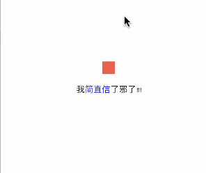

ElasticSpringLoading
---

ElasticSpringLoading 是一个简单的模拟文字弹簧效果。灵感来自于：[不烂漫的罪名](http://m.zcool.com.cn/work/ZMTI1Nzk3MjA=.html)

#### [English illustrate](README.md)





## 要求


swift3.0,iOS 8.0+ 


## 用法

```
let animateView = ElasticSpringLoading(frame: CGRect.init(x: 0, y: 100, width: view.bounds.size.width, height: 100))//You can display text
let attriString = NSMutableAttributedString(string: "Your Text")//Your text should not wrap,just support one line
animateView.attriString = attriString

self.view.addSubview(animateView)

```

你可以在主线程的任何时候改变文字，只需要这样：

```
animateView.attriString = newAttriString

```

## 安装

**目前只手动安装233...**

1. 下载最新版本的代码
2. 打开你的工程，把`ElasticSpringLoading`文件夹拖进你的工程。确保你选择Copy item
3. 重新编译项目


## 参与

希望大家多多提些意见啊，项目有什么问题的话请一定要告诉我呀，希望多多指出我的问题，感激不尽。
另外我的实现方式有几个地方我也知道不足，如果你们有好的修改方案的话一定要Pull request啊，很期待你的参与，再次感激。

## 有事儿的话联系我

#### 可以关注下我的简书，我发布过的文章有问题的话，评论指出哈，这非常有意义。

## 许可

[MIT license](LICENSE)


